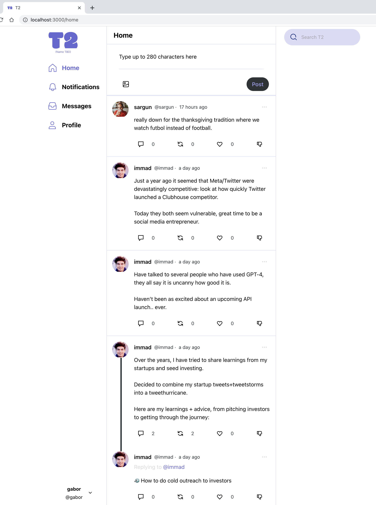

<h1>T2</h1>

The new public square

---

# Preview

# Developer instructions

TODO(poncianodiego): Please fill in instructions on:
* what branches to use ("develop" for feature branch PRs, main initially for deployment)
* Husky - what tags to use for commits
* A quick summary of how the app deploys to the cloud (the app runs in Docker locally, and deploys to ECS [like this](https://www.docker.com/blog/docker-compose-from-local-to-amazon-ecs/))

# Linear task list

The task list and task assignments are in [this Linear.app list](https://linear.app/townsquare/team/T2/active). Please request access if you don't have it.

# How to run

Check [here](RUNNING_LOCALLY.md) on how to run locally
